# The tracker these tools are built against

These hooks are **built for Notion**. The fastest way to use them is to
duplicate the ready-made board, which comes with all four views, the Gates
formula, a full how-it-works guide, and example cards already in place:

**▶ [Claude Project Kanban, the live Notion template](https://illustrious-othnielia-c26.notion.site/Claude-Project-Kanban-3a095c67143a81f59b35c15ad748b5ac)**: open it, then **Duplicate** into your own workspace.

**You do not need Notion AI.** The board is driven by a free Notion integration
(an API token) plus your own coding agent, Claude Code, running whatever model
you like (Anthropic, OpenAI, or anything else). There is no Notion AI
subscription and nothing "AI" running inside Notion itself: the intelligence is
your agent, the board is just the shared source of truth it reads and writes.

The card-workflow hooks (task-pickup-guard, task-edit-guard,
acceptance-checklist, done-checklist-guard) and the conductor/worker skills all
assume this shared **board**. The rest of this page documents its exact shape,
so you can recreate it by hand if you'd rather not duplicate the template.

## How the workflow fits together

Cards flow through a fixed lifecycle. A `Gates` formula watches each card and
refuses to let one skip a step; the hooks make that refusal physical. The
whole loop:

```mermaid
flowchart TD
    BD["Brain Dump"] --> BL["Backlog"] --> TD["To Do"]
    TD -->|"task-pickup-guard:<br/>move card + write criteria"| IP["In Progress"]
    EDIT{{"edit code"}} -. "task-edit-guard BLOCKS<br/>until the card moves" .-> IP
    ACC["acceptance-checklist auto-inserts<br/>the standard checklist"] -.-> IP
    IP --> RV["Review"] --> DN["Done"]
    IP -. "missing Plan / Test Approach" .-> ENTRY["&#9888; Entry gates incomplete"]
    DN -->|"done-checklist-guard:<br/>no checklist, no Done"| CHK{"Committed<br/>+ Pushed?"}
    CHK -->|"yes"| COMPLETE(["&#10003; Complete"])
    CHK -. "no" .-> EXIT["&#9888; Exit gates incomplete"]
```



**Entry gate**, a Feature/POC card in *In Progress* or *Review* must have
`Has Plan` and `Test Approach` ticked, or `Gates` reads *⚠ Entry gates
incomplete*. **Exit gate**, a *Done* card must have `Committed` and `Pushed`
ticked, or it reads *⚠ Exit gates incomplete*. Only *✓ Complete* is truly done.

### The Gates formula

`Gates` is a single Notion formula property. If you build the board by hand,
paste this in verbatim (Notion Formulas 2.0):

```
if(prop("Status") == "Done" and prop("Committed") and prop("Pushed"),
  "✓ Complete",
if(prop("Status") == "Done",
  "⚠ Exit gates incomplete",
if((prop("Status") == "In Progress" or prop("Status") == "Review")
    and (prop("Type") == "Feature" or prop("Type") == "POC")
    and (not prop("Has Plan") or not prop("Test Approach")),
  "⚠ Entry gates incomplete",
  "")))
```

It reads six properties (`Status`, `Committed`, `Pushed`, `Type`, `Has Plan`,
`Test Approach`) and outputs the badge shown on every card. Nothing else needs
to reference it; the string it returns is purely for the human (and the
session-start check reads the same properties directly).

## Notion template (reference implementation)

One Notion database, **"Project Kanban"**, where each card is a page, surfaced
through **four saved views**, the hooks and the conductor assume this exact
shape, so keep it if you duplicate the board:

- **Execution Board**: active work grouped by Status (To Do → In Progress → Review → Done)
- **Pipeline**: the upstream funnel (Brain Dump → Backlog → To Do)
- **Archive**: Done / Parked, kept out of the way
- **All Tasks**: the flat list

The properties the tools actually read or write:

| Property | Type | Used by |
|---|---|---|
| `Issue` | Title | everything (the card's name) |
| `Status` | Select: `Brain Dump` / `Backlog` / `To Do` / `In Progress` / `Review` / `Blocked` / `Done` / `Parked` | the workflow hooks + conductor assignment |
| `Type` | Select (`Feature`, `POC`, `Fix`, …) | Gates (entry gate applies to Feature/POC) |
| `Has Plan`, `Test Approach` | Checkboxes | **entry gate** before build |
| `Committed`, `Pushed`, `Tested` | Checkboxes | **exit gate** before Done |
| `Gates` | Formula | live entry/exit-gate signal on the card face |
| `References` | Text | file paths / docs / tickets the task touches |
| `Project`, `Epic` | Select | conductor (which lane a worker owns) + grouping |
| `Session ID`, `Session Started` | Text / Date | stamped at pickup for `claude --resume` recovery |
| `Blocked by` / `Blocks` | Relation (self) | conductor merge sequencing |

The **card body** carries acceptance criteria as native to-do blocks: that is
what `acceptance-checklist` inserts and what `done-checklist-guard` counts
before allowing Done. Body text below the checklist is free-form (plans,
handoff notes).

### Get it in two minutes

**[Duplicate the live template](https://illustrious-othnielia-c26.notion.site/Claude-Project-Kanban-3a095c67143a81f59b35c15ad748b5ac)** into your workspace, delete its
example cards, and share it with your integration. Or build it by hand: create a
database with the properties above,
add the four views, share it with your Notion integration, and put the token
where the hooks expect it (macOS Keychain item `notion-api-key`, or swap the
lookup for an env var). That is the entire setup.

## Built for Notion

This is a Notion tool and we are not going to pretend otherwise. The workflow it
enforces is small enough that it *could* be repurposed for another tracker: the
whole contract is four operations (read a card's status, change it, append
checklist items, count the unchecked ones), and each hook keeps its Notion calls
behind an "Adapting it" note if you want to try. But that is a porting job, not a
setting, and the hooks as shipped only speak Notion. If you want it working
today, it is for Notion.
